# Тестування працездатності системи

Для тестування було використано Postman.

## Запуск системи
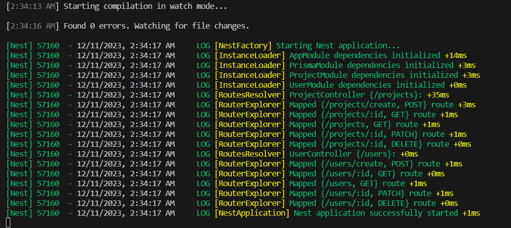

## Початкове наповнення бази даних

### Користувач
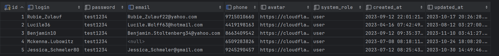

### Проєкт
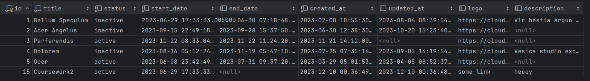

## Тестування запитів

### Користувач:

### Get (all)
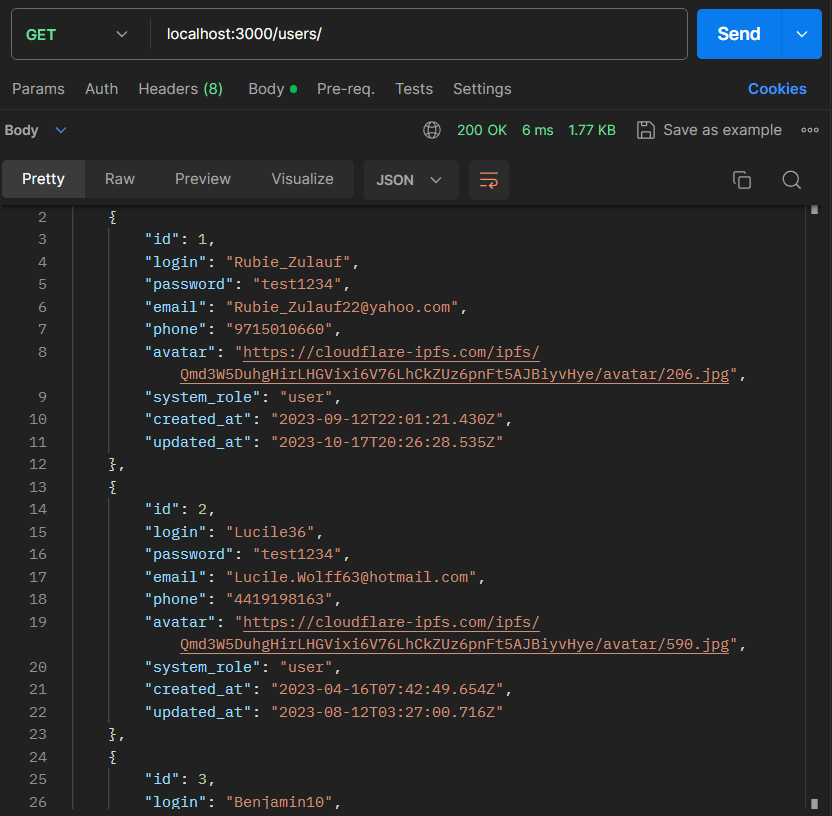
### Get (one)
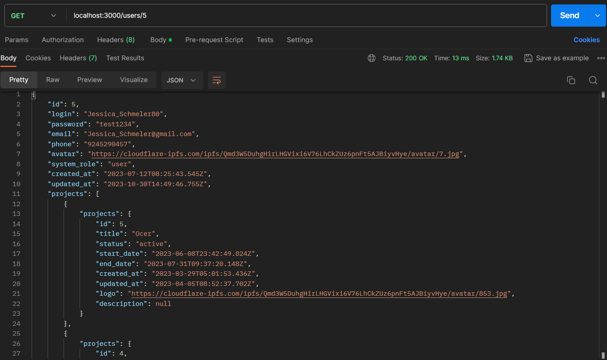
### Post
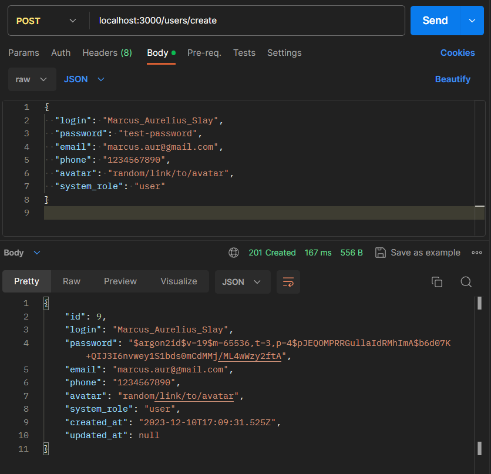
### Patch
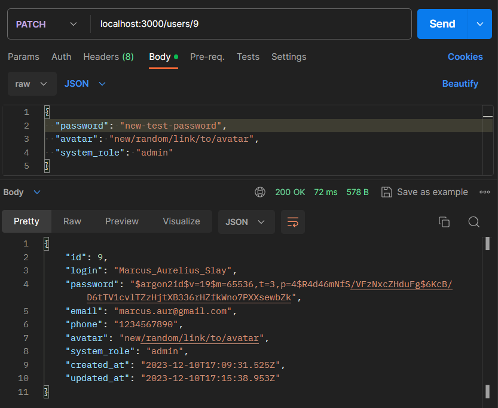
### Delete
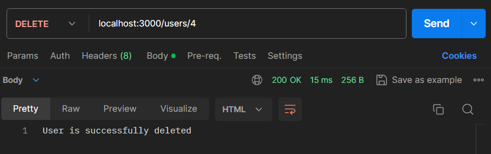
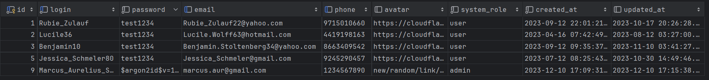

### Проєкт:

### Get (all)
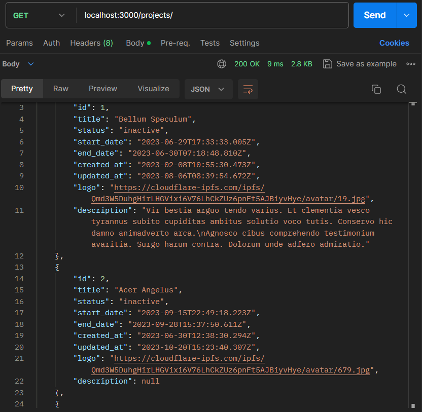
### Get (one)
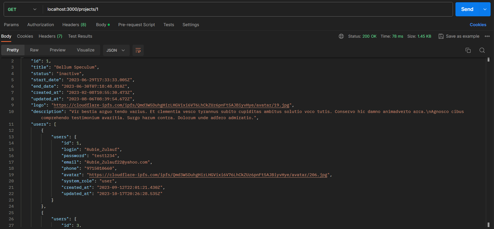
### Post
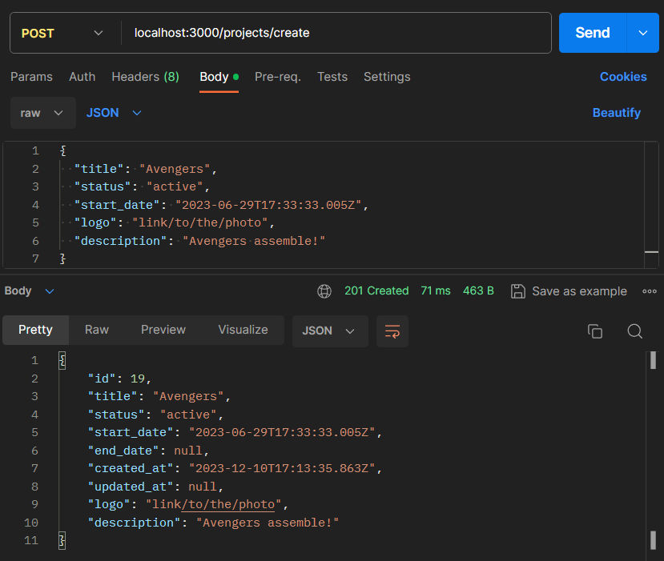
### Patch
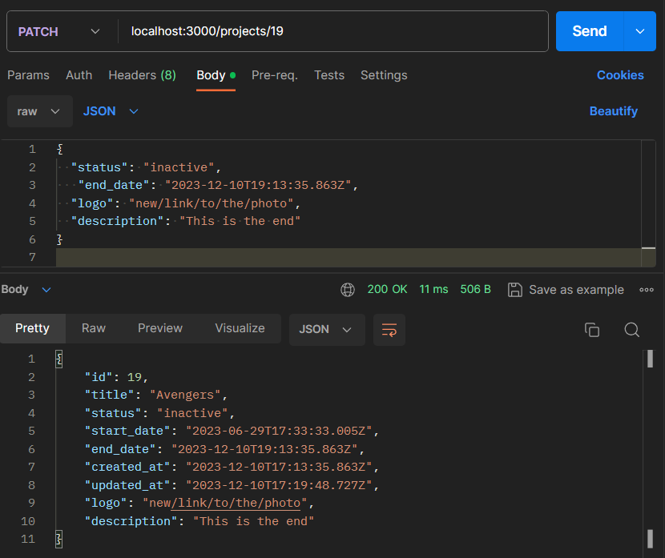
### Delete
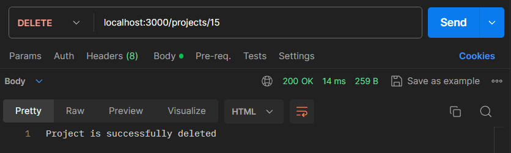
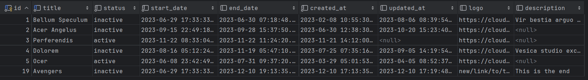

## Обробка помилок

## Bad request
### Користувач:
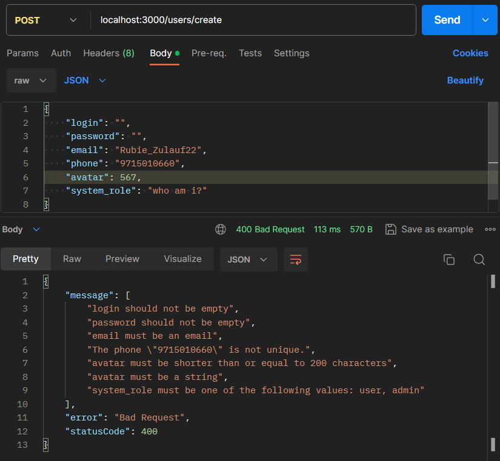
### Проєкт:
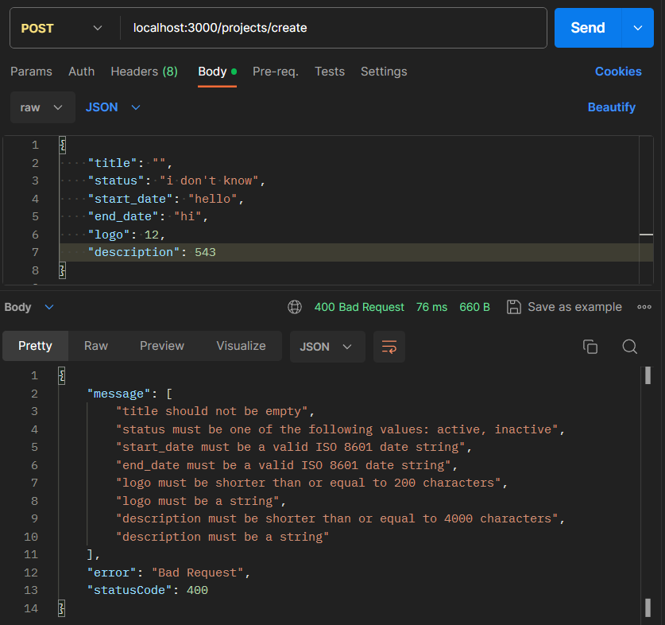

## Not found
### Користувач:
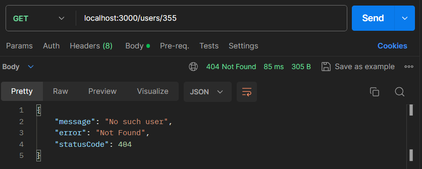
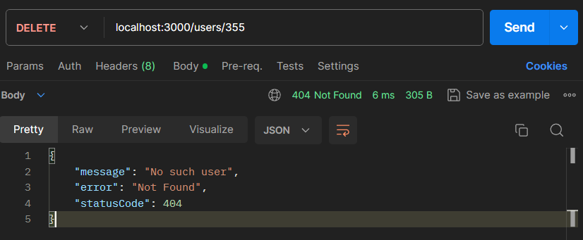
### Проєкт:
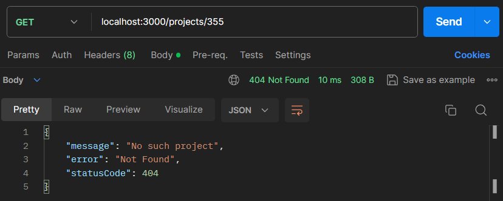
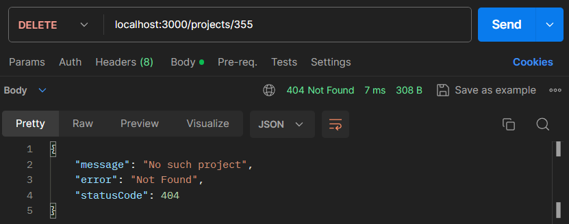
